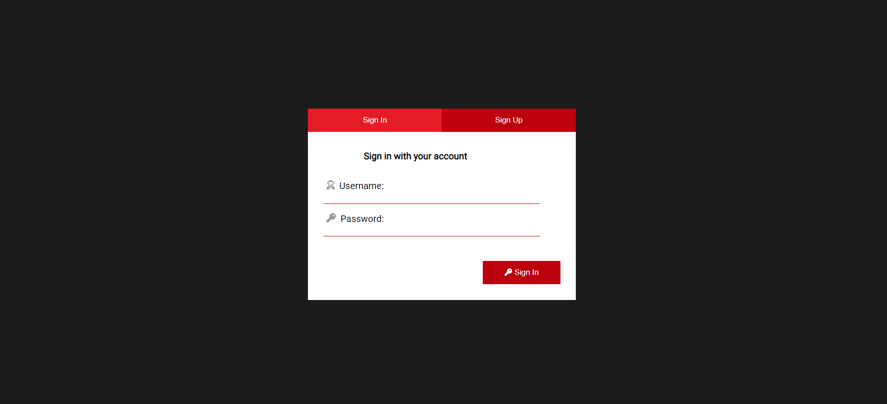
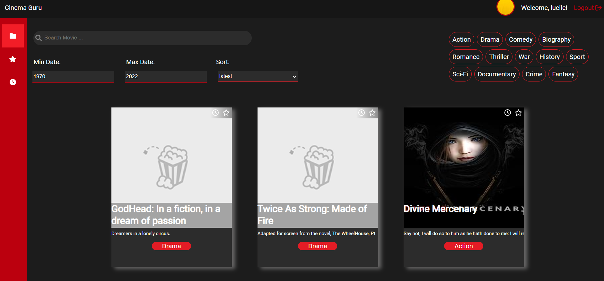
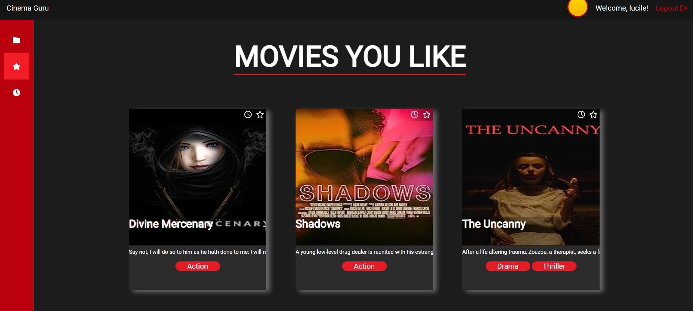

Welcome in the folder cinema, in this folder you can see the front-end of the application.

I used React framework and css to build the front.

I built first the general use components such as:
- Input
- SelectInput
- Button

Then I built the main App Component.

Then components:
- Login
- Register

Then the dashboard with:
- Header component
- Sidebar component
- Filter component
- MovieCard
- Homepage
- Favorites
- WatchLater

Some pictures:
Login: 
Homepage: 
Favorites: 
